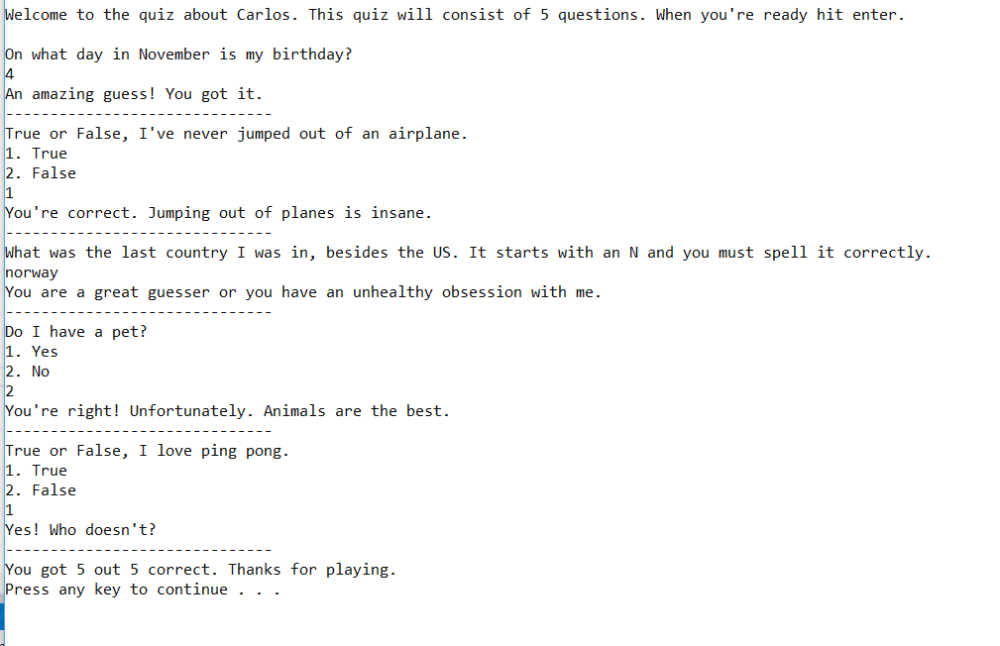

# Lab01-AboutMe
This is a program that asks question about myself so that I can practice C#

## Problem Domain
Create an About Me quiz that has at least 5 different questions.
Each question should be something fun, unique, or interesting about yourself

## How To Run
This application is built for the console. You can run it in the command line or PowerShell

## Visual
Here is an example and all the correct answers for the quiz
